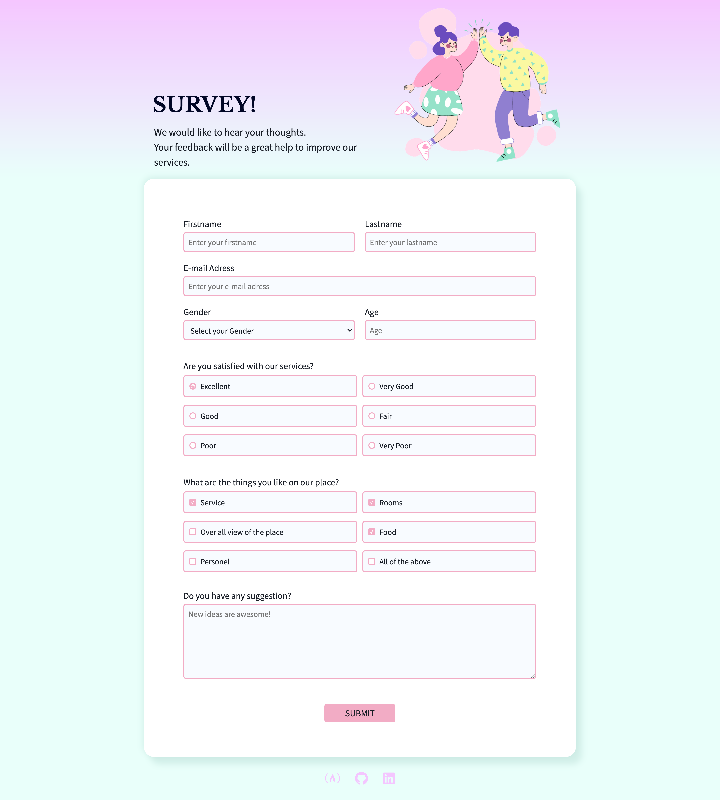
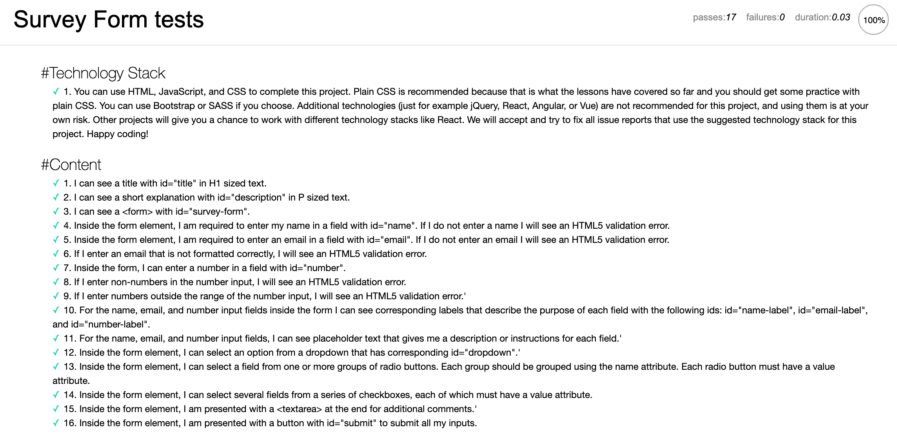
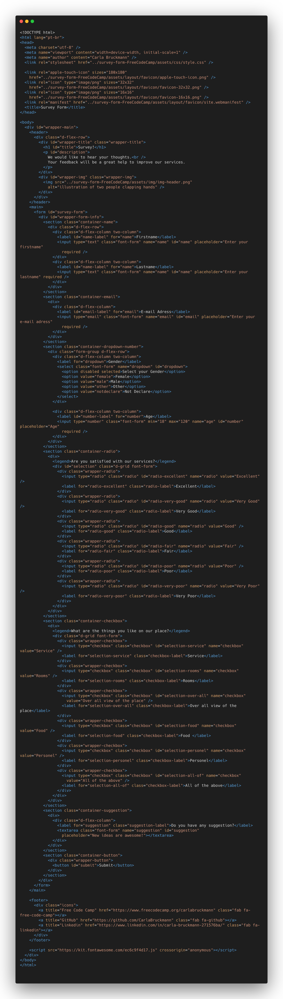
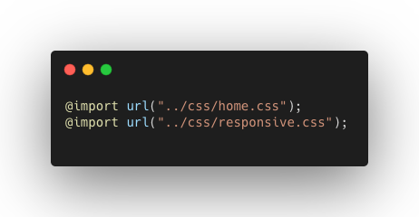
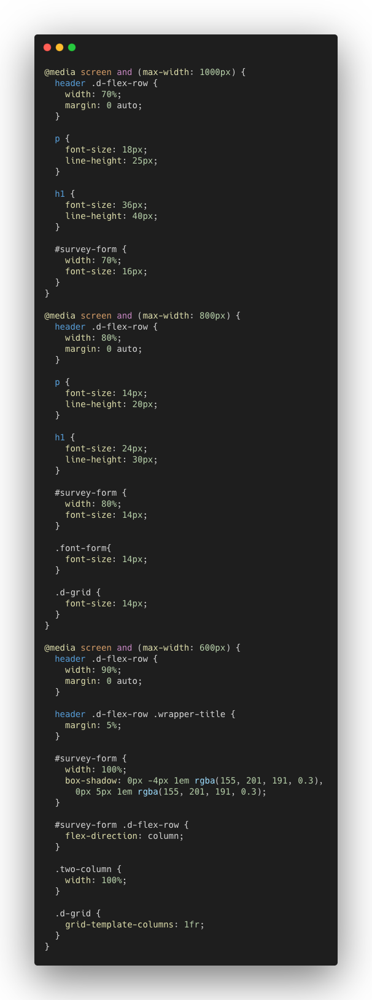

# Survey Form
#### _Responsive Web Design Certification - `freeCodeCamp - Project 2`_

### :rocket: Projeto desenvolvido para `Certificação de Web Design Responsivo` da plataforma `freeCodeCamp`.  

### :dart: Objetivo: construir um `Survey Form`, preenchendo `user stories` aprovados em testes. 

### :white_check_mark: Tecnologias utilizadas: `HTML5` e `CSS3`.

🌎  *[CodePen](https://codepen.io/carlabruckmann/pen/zYoyejV)* - *[freeCodeCamp](https://www.freecodecamp.org/carlabruckmann)* 

[Preview - Home]

[Test]

[Preview - index.html]

[Preview - style.css]

[Preview - home.css]

[Preview - responsive.css]

